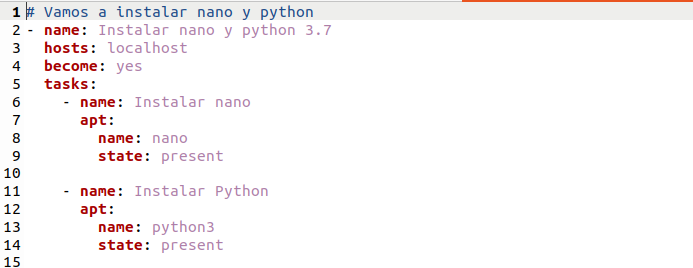

# Ansible

Lo primero que realizaremos son los playbook:
    - El primero instalará nano y Python 
    - En este segundo playbook, creamos un entorno virtual de Python.
    - En el tercer playbook, ejecutaremos un script Python que imprimirá "Hola".

Ahora ejecutaremos los siguientes pasos:

-Abrimos el terminal y usamos el comando "docker images" para mostrar las imágenes que tenemos en nuestro ordenador.

-Este es el DockerFile que ejecutaremos para crear la imagen de Docker que incluirá los playbooks.

Creamos la carpeta de "playbooks" en la que guardamos los 3 .yml que hemos creado. 

-El primero que crearemos será el de instalación, para poder realizar los siguientes pasos.

-El segundo que crearemos será el playbook que crea el entorno virtual en Python, ahora ya que tenemos instalado Python.

-Por último ejecutaremos el script de Python que ejecuta el mensaje "Hola".

Una vez creamos los playbook para montar el docker ejecutaremos el siguiente comando:
**docker build -t ansible-container .**

-Después de construir el Docker debemos ejecutar el contenedor para ello ejecutamos el comando **docker run ansible-container**

-Vemos que se ejecuta correctamente

